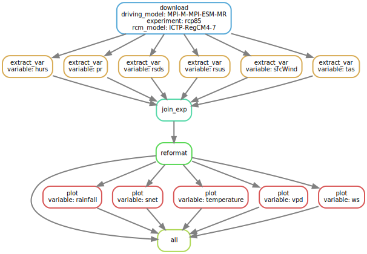

getCordex - Get projection data from CORDEX
================
Sylvain Schmitt
April 18, 2023

- <a href="#data" id="toc-data">Data</a>
- <a href="#installation" id="toc-installation">Installation</a>
- <a href="#usage" id="toc-usage">Usage</a>
  - <a href="#locally" id="toc-locally">Locally</a>
  - <a href="#hpc" id="toc-hpc">HPC</a>
- <a href="#workflow" id="toc-workflow">Workflow</a>

[`singularity` &
`snakemake`](https://github.com/sylvainschmitt/snakemake_singularity)
workflow to download projection data from CORDEX.



# Data

**[CORDEX](https://cordex.org/): Cordinated Regional Climae Downscaling
Experiment**

*The CORDEX vision is to advance and coordinate the science and
application of regional climate downscaling through global
partnerships.*

Data are focused here on South-America (**SAM**), but WGET scripts can
be added in the `wget` folder.

We particularly focused on domain **SAM-22** with following variables:
**Near-Surface Air Temperature** (tas) **Near-Surface Relative
Humidity** (hurs), **Near-Surface Wind Speed** (sfcWind),
**Precipitation** (pr), **Surface Downwelling Shortwave Radiation**
(rsds), & **Surface Upwelling Shortwave Radiation** (rsus). We
restricted outputs at a **3hr** time-frequency and used the last
available downscaling (**v1**). We used 3 types of experiments: one
historical (**historical**) and two Representative Concentration Pathway
RCP 2.6 & 8.5 (**rcp26** & **rcp85**). We had 5 driving models available
(**ECMWF-ERAINT**, **MOHC-HadGEM2-ES**, **MPI-M-MPI-ESM-LR**,
**MPI-M-MPI-ESM-MR**, **NCC-NorESM1-M**) coupled with 2 RCM model
(**REMO2015** & **RegCM4-7**).

Data are retrieve from the [Institut Pierre-Simon Laplace
node](https://esgf-node.ipsl.upmc.fr/search/cordex-ipsl/). You need
first to [create an
account](https://esgf.github.io/esgf-user-support/user_guide.html#create-an-account)
on this page ([create
account](https://esgf-node.ipsl.upmc.fr/user/add/?next=http://esgf-node.ipsl.upmc.fr/search/cordex-ipsl/)
link at corner right).

Then you’ll need to register credentials locally to use the workflow. A
help page is available here:
<https://esgf.github.io/esgf-user-support/user_guide.html?highlight=credentials%20pem#access-data-with-the-command-line-via-opendap>.
In linux, you need `myproxy-logon` installed and to run this command
line (with your user name):

``` bash
myproxy-logon -sesgf-node.ipsl.upmc.fr -l {user_name} -b -T -t 72 -o ~/.esg/credentials.pem
```

To run the workflow on a cluster, you can simply copy your local
credentials to the cluster. For instance:

``` bash
cp ~/.esg/credentials.pem /my_cluster/
```

# Installation

- [x] Python ≥3.5
- [x] Snakemake ≥5.24.1
- [x] Golang ≥1.15.2
- [x] Singularity ≥3.7.3
- [x] This workflow

``` bash
# Python
sudo apt-get install python3.5
# Snakemake
sudo apt install snakemake`
# Golang
export VERSION=1.15.8 OS=linux ARCH=amd64  # change this as you need
wget -O /tmp/go${VERSION}.${OS}-${ARCH}.tar.gz https://dl.google.com/go/go${VERSION}.${OS}-${ARCH}.tar.gz && \
sudo tar -C /usr/local -xzf /tmp/go${VERSION}.${OS}-${ARCH}.tar.gz
echo 'export GOPATH=${HOME}/go' >> ~/.bashrc && \
echo 'export PATH=/usr/local/go/bin:${PATH}:${GOPATH}/bin' >> ~/.bashrc && \
source ~/.bashrc
# Singularity
mkdir -p ${GOPATH}/src/github.com/sylabs && \
  cd ${GOPATH}/src/github.com/sylabs && \
  git clone https://github.com/sylabs/singularity.git && \
  cd singularity
git checkout v3.7.3
cd ${GOPATH}/src/github.com/sylabs/singularity && \
  ./mconfig && \
  cd ./builddir && \
  make && \
  sudo make install
# detect Mutations
git clone git@github.com:sylvainschmitt/getCordex.git
cd getCordex
```

# Usage

## Locally

``` bash
snakemake -np -j 1 --resources mem_mb=10000 # dry run
snakemake --dag | dot -Tsvg > dag/dag.svg # dag
snakemake -j 1 --resources mem_mb=10000 # run
```

## HPC

### Muse

``` bash
module load snakemake # for test on node
snakemake -np # dry run
sbatch job_muse.sh # run
```

### Genologin

``` bash
module load bioinfo/snakemake-5.25.0 # for test on node
snakemake -np # dry run
sbatch job_genologin.sh # run
```

# Workflow

### [download](https://github.com/sylvainschmitt/getCordex/blob/main/rules/download.smk)

### [extract_var](https://github.com/sylvainschmitt/getCordex/blob/main/rules/extract_var.smk)

- Script:
  [`extract_var.R`](https://github.com/sylvainschmitt/getCordex/blob/main/scripts/extract_var.R)

### [join_exp](https://github.com/sylvainschmitt/getCordex/blob/main/rules/join_exp.smk)

- Script:
  [`join_exp.R`](https://github.com/sylvainschmitt/getCordex/blob/main/scripts/join_exp.R)

### Prepare for troll

### Automatic report?
