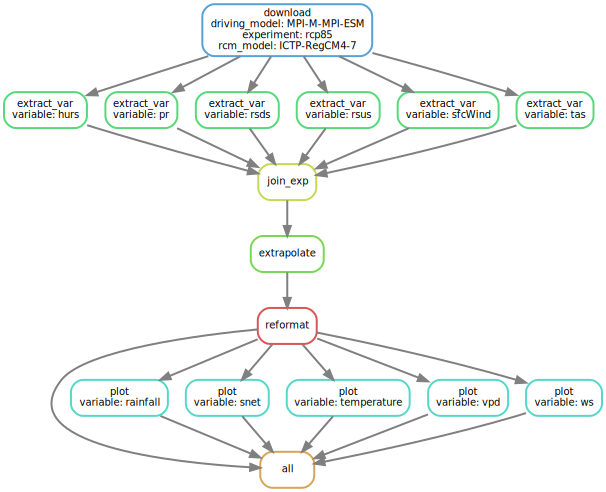

getCordex - Get projection data from CORDEX
================
Sylvain Schmitt
April 18, 2023

- <a href="#installation" id="toc-installation">Installation</a>
- <a href="#usage" id="toc-usage">Usage</a>
  - <a href="#locally" id="toc-locally">Locally</a>
  - <a href="#hpc" id="toc-hpc">HPC</a>
- <a href="#workflow" id="toc-workflow">Workflow</a>

[`singularity` &
`snakemake`](https://github.com/sylvainschmitt/snakemake_singularity)
workflow to infer growth from Guyafor data.



# Installation

- [x] Python ≥3.5
- [x] Snakemake ≥5.24.1
- [x] Golang ≥1.15.2
- [x] Singularity ≥3.7.3
- [x] This workflow

``` bash
# Python
sudo apt-get install python3.5
# Snakemake
sudo apt install snakemake`
# Golang
export VERSION=1.15.8 OS=linux ARCH=amd64  # change this as you need
wget -O /tmp/go${VERSION}.${OS}-${ARCH}.tar.gz https://dl.google.com/go/go${VERSION}.${OS}-${ARCH}.tar.gz && \
sudo tar -C /usr/local -xzf /tmp/go${VERSION}.${OS}-${ARCH}.tar.gz
echo 'export GOPATH=${HOME}/go' >> ~/.bashrc && \
echo 'export PATH=/usr/local/go/bin:${PATH}:${GOPATH}/bin' >> ~/.bashrc && \
source ~/.bashrc
# Singularity
mkdir -p ${GOPATH}/src/github.com/sylabs && \
  cd ${GOPATH}/src/github.com/sylabs && \
  git clone https://github.com/sylabs/singularity.git && \
  cd singularity
git checkout v3.7.3
cd ${GOPATH}/src/github.com/sylabs/singularity && \
  ./mconfig && \
  cd ./builddir && \
  make && \
  sudo make install
# detect Mutations
git clone git@github.com:sylvainschmitt/getCordex.git
cd getCordex
```

# Usage

## Locally

``` bash
snakemake -np -j 1 --resources mem_mb=10000 # dry run
snakemake --dag | dot -Tsvg > dag/dag.svg # dag
snakemake -j 1 --resources mem_mb=10000 # run
```

## HPC

### Muse

``` bash
module load snakemake # for test on node
snakemake -np # dry run
sbatch job_muse.sh # run
```

### Genologin

``` bash
module load bioinfo/snakemake-5.25.0 # for test on node
snakemake -np # dry run
sbatch job_genologin.sh # run
```

# Workflow

### [download](https://github.com/sylvainschmitt/download/blob/rules/download.smk)
